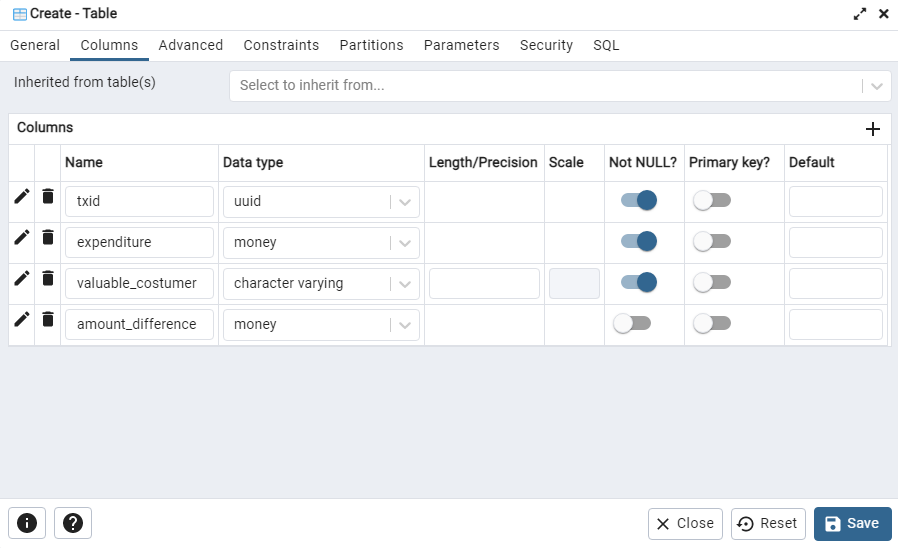

# Data_Streaming_ETL

The mock_api.py generates data using uuid for unique ids and a simple number generator for the amount of money.

The ingest.py takes the data generated by the mock_api, creates a label based on certain characteristics, and calculates the difference between the first and next expenditure amount. Ingest.py will then store that data in four different columns in a postgresql database.

Instructions:
Create a database and name it as you please.

Create a config.py file and add the following syntax to it:
db_config = {
    'dbname': 'yourdbname,
    'user': 'postgresuser',
    'password': 'postgrespassword'
}

You will also need to create your own table

Follow the image below:

All you need to do now is run the mock_apy.py file and then the ingest.py file.
